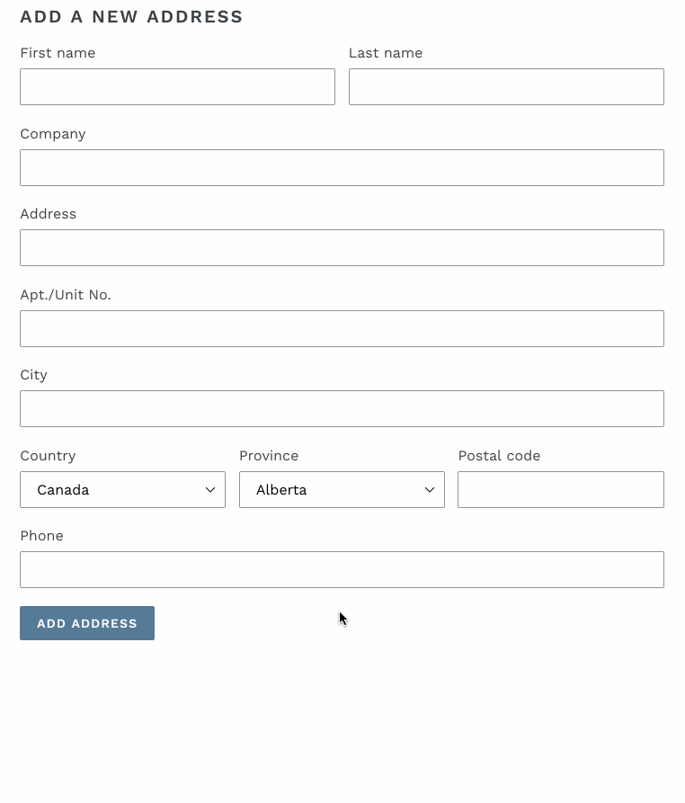

# @shopify/theme-addresses

`theme-addresses.js` helps localizing address forms.

## Demo



## Getting Started

Theme Scripts can be used in any theme project. To take advantage of semantic versioning and easy updates, we recommend using NPM or Yarn to include them in your project:

```
yarn add @shopify/theme-addresses
```

and then import the functions you wish to use through ES6 imports:

```
import {AddressForm} from '@shopify/theme-addresses`;
```

If you prefer not to use a package manager, you can download the latest version of Theme Addresses and include it in your project manually from the following links:

- [theme-addresses.js](http://unpkg.com/@shopify/theme-addresses@latest/dist/theme-addresses.js)
- [theme-addresses.min.js](http://unpkg.com/@shopify/theme-addresses@latest/dist/theme-addresses.min.js)

## Browser Support

Theme Addresses uses two APIs not available to legacy browsers, Fetch and Promise. If you wish to support legacy browsers, make sure you add the following dependencies to your project:

```es6
yarn add unfetch es6-promise
```

and then import them before you import Theme Addresses:

```es6
// Only need to import these once
import 'unfetch/polyfill';
import 'es6-promise/auto';

// Import @shopify/theme-address anywhere you need it
import {AddressForm} from '@shopify/theme-addresses';
```

## Methods

### `AddressForm(rootElement, locale, options)`

Returns a Promise that will resolve when the loading is finished

- rootElement: wrapper element of the form elements. Form fields will be appended to that element.
- locale: locale in which you want the form labels, country names and zone names to be rendered
- options:
  - shippingCountriesOnly: (optional) boolean - If set to true, will only show countries that the store ships to.
  - inputSelectors: (optional) object - input selectors of inputs
    - lastName
    - firstName
    - company
    - address1
    - address2
    - country
    - zone
    - postalCode
    - city
    - phone

```js
// In addresses.js
import {AddressForm} from '@shopify/theme-addresses';

AddressForm(document.querySelector('[data-address=root]'), 'en');
```

Running `AddressForm` will:

- Reorder the fields in the DOM based on the selected country. The order is based of the country: every country expect fields to be ordered differently.
- Update the labels of the fields: labels change from a country to another, eg.: zones are called `province` in Canada whereas they are called `state` in the US.

We expect every `label` / `input` or `label` / `select` to be wrapped by a `div` and all `div` be at the same level. See example below.

## Example:

```html
<form data-address="root">
  <div>
    <label for="AddressFirstName">{{ 'customer.addresses.first_name' | t }}</label>
    <input type="text" id="AddressFirstName" name="address[first_name]" value="{{ form.first_name }}">
  </div>

  <div>
    <label for="AddressLastName">{{ 'customer.addresses.last_name' | t }}</label>
    <input type="text" id="AddressLastName" name="address[last_name]" value="{{ form.last_name }}">
  </div>

  <div>
    <label for="AddressCompany">{{ 'customer.addresses.company' | t }}</label>
    <input type="text" id="AddressCompany" name="address[company]" value="{{ form.company }}">
  </div>

  <div>
    <label for="AddressAddress1">{{ 'customer.addresses.address1' | t }}</label>
    <input type="text" id="AddressAddress1" name="address[address1]" value="{{ form.address1 }}">
  </div>

  <div>
    <label for="AddressAddress2">{{ 'customer.addresses.address2' | t }}</label>
    <input type="text" id="AddressAddress2" name="address[address2]" value="{{ form.address2 }}">
  </div>

  <div>
    <label for="AddressCity">{{ 'customer.addresses.city' | t }}</label>
    <input type="text" id="AddressCity" name="address[city]" value="{{ form.city }}">
  </div>

  <div>
    <label for="AddressCountry">{{ 'customer.addresses.country' | t }}</label>
    <select id="AddressCountry" name="address[country]" data-default="{{ form.country }}"></select>
  </div>

  <div>
    <label for="AddressProvince">{{ 'customer.addresses.province' | t }}</label>
    <select id="AddressProvince" name="address[province]" data-default="{{ form.province }}"></select>
  </div>

  <div>
    <label for="AddressZip">{{ 'customer.addresses.zip' | t }}</label>
    <input type="text" id="AddressZip" name="address[zip]" value="{{ form.zip }}" autocapitalize="characters">
  </div>

  <div>
    <label for="AddressPhone">{{ 'customer.addresses.phone' | t }}</label>
    <input type="tel" id="AddressPhone" name="address[phone]" value="{{ form.phone }}">
  </div>
</form>
```

```css
[data-address='root'] [data-aria-hidden='true'] {
  display: none;
}

[data-address='root'] {
  display: flex;
  flex-direction: row;
  flex-wrap: wrap;
  justify-content: space-between;
}

[data-line-count='1'] {
  flex-basis: 100%;
}
[data-line-count='2'] {
  flex-basis: 49%;
}
[data-line-count='3'] {
  flex-basis: 32%;
}
```
